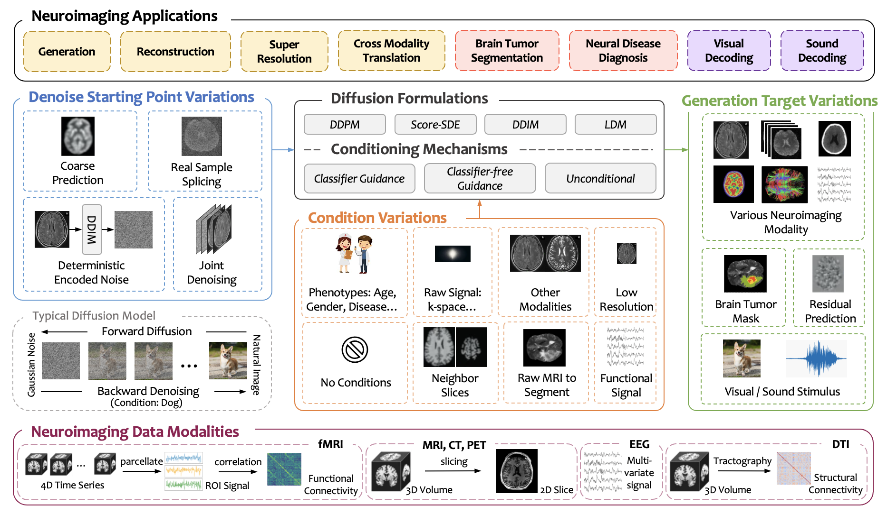

# Diffusion Models for Computational Neuroimaging: A Survey
This repository contains resources and a curated list of papers from our survey on diffusion models in computational neuroimaging.

## 📄 Survey Paper
[**Diffusion Models for Computational Neuroimaging: A Survey**](https://arxiv.org/abs/XXXX.XXXXX)

**Authors**:  
Haokai Zhao, Haowei Lou, Lina Yao, Wei Peng, Ehsan Adeli, Kilian M. Pohl, Yu Zhang  

    

---

## 📚 Table of Contents
### Data Generation

Expand

| **Year** | **Conference** | **Title** | **Authors** | **Links** |
|----------|----------------|-----------|-------------|-----------|
| 2022 | MICCAI | Brain imaging generation with latent diffusion models | Pinaya et al. | [📄 Paper](https://link.springer.com/chapter/10.1007/978-3-031-18576-2_12) |
| 2023 | MICCAI | Generating Realistic Brain MRIs via a Conditional Diffusion Probabilistic Model | Peng et al. | [📄 Paper](https://link.springer.com/chapter/10.1007/978-3-031-43993-3_2) |
| 2023 | NeurIPS | Synthetic Sleep EEG Signal Generation using Latent Diffusion Models | Aristimunha et al. | [📄 Paper](https://openreview.net/pdf?id=mDwURmlapW) |
| 2024 | ICLR | Diffusion-TS: Interpretable Diffusion for General Time Series Generation | Yuan & Qiao | [📄 Paper](https://openreview.net/pdf?id=4h1apFjO99) |

### Reconstruction

Expand

| **Year** | **Conference** | **Title** | **Authors** | **Links** |
|----------|----------------|-----------|-------------|-----------|
| 2022 | ICLR | Solving Inverse Problems in Medical Imaging with Score-Based Generative Models | Song et al. | [📄 Paper](https://openreview.net/pdf?id=vaRCHVj0uGI) |
| 2023 | NMR in Biomedicine | WKGM: weighted k-space generative model for parallel imaging reconstruction | Tu et al. | [📄 Paper](https://analyticalsciencejournals.onlinelibrary.wiley.com/doi/full/10.1002/nbm.5005) |
| 2023 | MICCAI | Contrastive diffusion model with auxiliary guidance for coarse-to-fine PET reconstruction | Han et al. | [📄 Paper](https://link.springer.com/chapter/10.1007/978-3-031-43999-5_23) |

### Super-Resolution

Expand

| **Year** | **Conference** | **Title** | **Authors** | **Links** |
|----------|----------------|-----------|-------------|-----------|
| 2023 | MICCAI | Inversesr: 3d brain mri super-resolution using a latent diffusion model | Wang et al. | [📄 Paper](https://dl.acm.org/doi/abs/10.1007/978-3-031-43999-5_42) |
| 2023 | MICCAI | Disc-diff: Disentangled conditional diffusion model for multi-contrast mri super-resolution | Mao et al. | [📄 Paper](https://link.springer.com/chapter/10.1007/978-3-031-43999-5_37) |
| 2024 | CVPR | Rethinking diffusion model for multi-contrast mri super-resolution | Li et al. | [📄 Paper](https://openaccess.thecvf.com/content/CVPR2024/html/Li_Rethinking_Diffusion_Model_for_Multi-Contrast_MRI_Super-Resolution_CVPR_2024_paper.html) |
| 2024 | arXiv | Spatio-Temporal Adaptive Diffusion Models for EEG Super-Resolution in Epilepsy Diagnosis | Zhou & Wang | [📄 Paper](https://arxiv.org/html/2407.03089v1) |

### Cross-Modality Translation

Expand

| **Year** | **Conference** | **Title** | **Authors** | **Links** |
|----------|----------------|-----------|-------------|-----------|
| 2024 | WACV | Adaptive latent diffusion model for 3d medical image to image translation: Multi-modal magnetic resonance imaging study | Kim and Park | [📄 Paper](https://openaccess.thecvf.com/content/WACV2024/html/Kim_Adaptive_Latent_Diffusion_Model_for_3D_Medical_Image_to_Image_WACV_2024_paper.html) |
| 2023 | MICCAI | Cola-diff: Conditional latent diffusion model for multi-modal mri synthesis | Jiang et al. | [📄 Paper](https://link.springer.com/chapter/10.1007/978-3-031-43999-5_38) |
| 2024 | JBHI | Target-Guided Diffusion Models for Unpaired Cross-modality Medical Image Translation | Luo et al. | [📄 Paper](https://ieeexplore.ieee.org/abstract/document/10508481) |
| 2024 | TMI | Multi-modal Modality-masked Diffusion Network for Brain MRI Synthesis with Random Modality Missing | Meng et al. | [📄 Paper](https://ieeexplore.ieee.org/abstract/document/10508481) |

### Neural Disorder Diagnosis

Expand

| **Year** | **Conference** | **Title** | **Authors** | **Links** |
|----------|----------------|-----------|-------------|-----------|
| 2023 | ISPCE-ASIA | Generative ai enables eeg data augmentation for alzheimer’s disease detection via diffusion model | Zong et al. | [📄 Paper](https://ieeexplore.ieee.org/abstract/document/10365931) |
| 2025 | JNE | Diffusion transformer-augmented fMRI functional connectivity for enhanced autism spectrum disorder diagnosis | Zhao et al. | [📄 Paper](https://iopscience.iop.org/article/10.1088/1741-2552/adb07a/meta) |
| 2024 | ISBI | BrainNetDiff: Generative AI Empowers Brain Network Construction Via Multimodal Diffusion | Zong et al. | [📄 Paper](https://ieeexplore.ieee.org/abstract/document/10635395) |
| 2024 | TPAMI | A New Brain Network Construction Paradigm for Brain Disorder Via Diffusion-Based Graph Contrastive Learning | Zong et al. | [📄 Paper](https://ieeexplore.ieee.org/abstract/document/10636067) |

### Brain Tumor Segmentation

Expand

| **Year** | **Conference** | **Title** | **Authors** | **Links** |
|----------|----------------|-----------|-------------|-----------|
| 2024 | MIDL | Medsegdiff: Medical image segmentation with diffusion probabilistic model | Wu et al. | [📄 Paper](https://proceedings.mlr.press/v227/wu24a.html) |
| 2024 | JBHI | CorrDiff: Corrective Diffusion Model for Accurate MRI Brain Tumor Segmentation | Li et al. | [📄 Paper](https://ieeexplore.ieee.org/abstract/document/10398439) |
| 2022 | MICCAI | Fast unsupervised brain anomaly detection and segmentation with diffusion models | Pinaya et al. | [📄 Paper](https://link.springer.com/chapter/10.1007/978-3-031-16452-1_67) |

### Visual Decoding

Expand

| **Year** | **Conference** | **Title** | **Authors** | **Links** |
|----------|----------------|-----------|-------------|-----------|
| 2023 | CVPR | High-resolution image reconstruction with latent diffusion models from human brain activity | Takagi & Nishimoto | [📄 Paper](https://openaccess.thecvf.com/content/CVPR2023/html/Takagi_High-Resolution_Image_Reconstruction_With_Latent_Diffusion_Models_From_Human_Brain_CVPR_2023_paper.html) |
| 2023 | CVPR | Seeing beyond the brain: Conditional diffusion model with sparse masked modeling for vision decoding | Chen et al. | [📄 Paper](https://openaccess.thecvf.com/content/CVPR2023/html/Chen_Seeing_Beyond_the_Brain_Conditional_Diffusion_Model_With_Sparse_Masked_CVPR_2023_paper.html) |
| 2024 | NeurIPS | Brain diffusion for visual exploration: Cortical discovery using large scale generative models | Luo et al. | [📄 Paper](https://proceedings.neurips.cc/paper_files/paper/2023/hash/ef0c0a23a1a8219c4fc381614664df3e-Abstract-Conference.html) |

### Speech Decoding

Expand

| **Year** | **Conference** | **Title** | **Authors** | **Links** |
|----------|----------------|-----------|-------------|-----------|
| 2024 | arXiv | Reverse the auditory processing pathway: Coarse-to-fine audio reconstruction from fMRI | Liu et al. | [📄 Paper](https://arxiv.org/pdf/2405.18726) |

---

## Datasets & Resources
- **OpenNeuro**: Public neuroimaging datasets ([link](https://openneuro.org/)).
- **ADNI**: Alzheimer's Disease Neuroimaging Initiative ([link](https://adni.loni.usc.edu/)).
- **UK Biobank**: Large-scale biomedical database ([link](https://www.ukbiobank.ac.uk/)).
- **BraTS**: Brain Tumor Segmentation Challenge ([link](https://www.med.upenn.edu/cbica/brats/)).
- **ABIDE**: Autism Brain Imaging Data Exchange (ASD and control neuroimaging data) ([link](http://fcon_1000.projects.nitrc.org/indi/abide/)).
- **ABCD**: Adolescent Brain Cognitive Development Study (longitudinal pediatric neuroimaging) ([link](https://abcdstudy.org/)).
---
